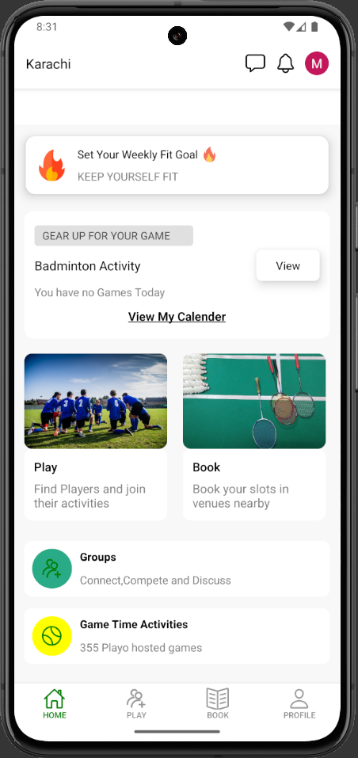
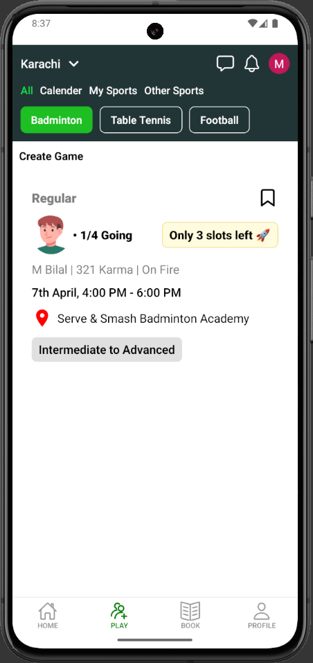
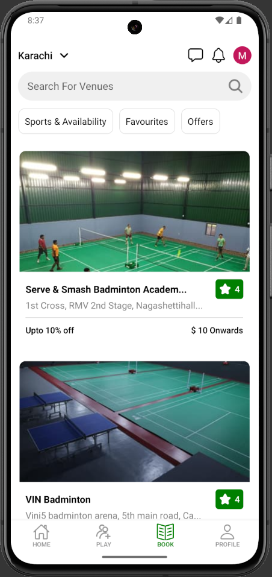
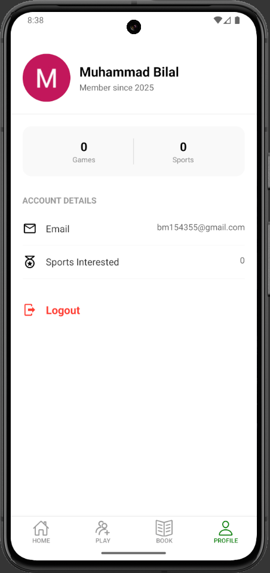
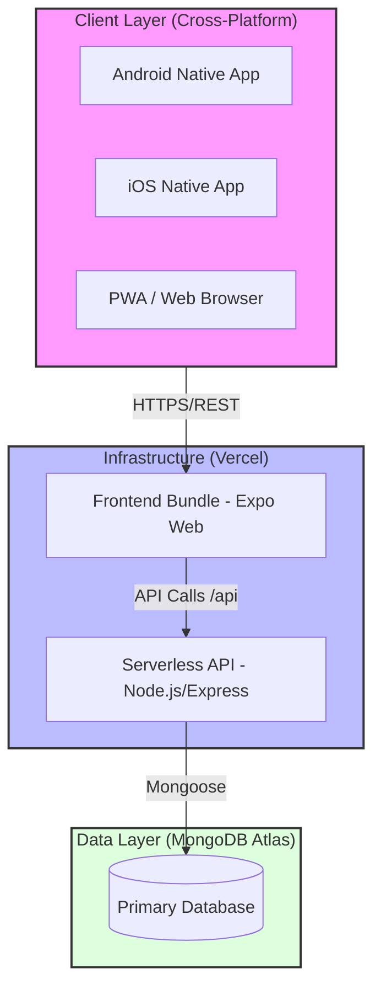
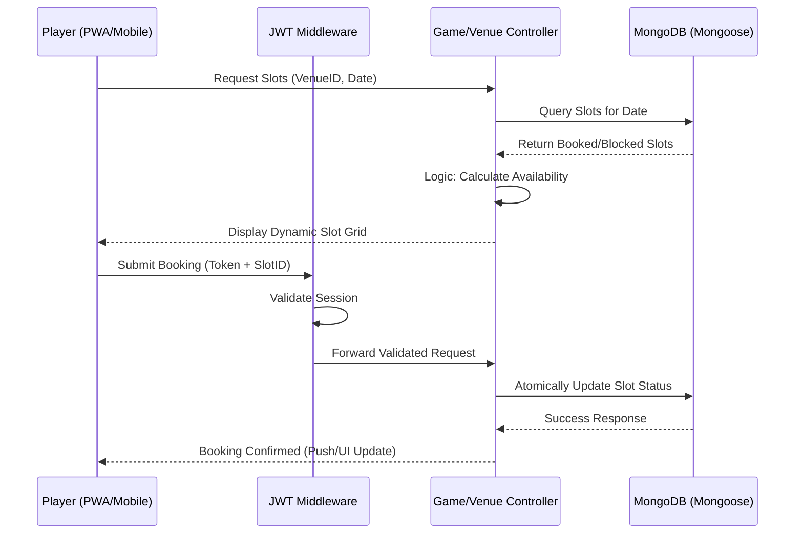

# 🏟️ PlaySpace · Enterprise-Grade Sports Venue & Slot Booking Platform

## 🏷️ Badges

---


## 📖 Executive Summary

---

PlaySpace is a high-performance, full-stack sports management ecosystem designed to bridge the gap between venue owners and athletes. Engineered with a React Native CLI core, the platform offers a unified codebase that powers both a native Android experience and a highly responsive Progressive Web App (PWA) via Expo Web. It features a sophisticated Role-Based Access Control (RBAC) system, real-time slot synchronization, and an architecturally sound monorepo structure.

## 📸 Visual Tour

---

<p align="center">
  
  
  
  
</p>

## 📊 High‑Level Architecture

---



## 📊 Low‑Level Architecture

---



## ✨ Core Modules & Capabilities

---

### 1) Player Ecosystem (User-End)

- Venue Discovery: Intuitive exploration of nearby sports complexes and available amenities.
- Dynamic Slot Selection: A reactive booking interface that reflects admin-defined constraints (Date, Time, Sport Type) in real-time.
- Zero-Install Experience: Fully optimized PWA allowing users to access the platform instantly via mobile browsers.

### 2) Administrative Control (Admin-End)

- Game Orchestration: Tools to host new matches, reserve specific venues, and set granular slot pricing.
- Availability Management: Real-time toggling of slot statuses to prevent overbooking and manage peak-hour traffic.
- User Oversight: Centralized dashboard to monitor participant lists and booking histories.

### 3) Architectural Excellence

- Hybrid Deployment: Seamlessly transitions between a native environment and a web-based environment using a shared logic layer.
- CORS-Compliant Networking: Secure cross-origin resource sharing specifically tuned for PWA-to-Server communication.
- Scalable Monorepo: A unified repository structure that streamlines continuous integration and deployment (CI/CD) on Vercel.

## 🧰 Technology Stack

---

| Layer      | Technology                  | Purpose                                                           |
| ---------- | --------------------------- | ----------------------------------------------------------------- |
| Frontend   | React Native CLI & Expo Web | High-performance native mobile UI with seamless PWA distribution  |
| State      | React Context API / Hooks   | Efficient state management for booking flows and user sessions    |
| Backend    | Node.js, Express (ES6+)     | Scalable REST API for venue management and slot orchestration     |
| DB         | MongoDB + Mongoose          | Schema-based document storage for flexible sports data modeling   |
| Auth       | JWT (JSON Web Tokens)       | Stateless authentication and secure role-based access control     |
| Maps & Geo | RN Maps & Geocoder          | Venue location visualization and address-to-coordinate conversion |
| Styling    | React Native Stylesheets    | Optimized, platform-agnostic styling for consistent UI/UX         |
| Hosting    | Vercel Serverless           | Automated CI/CD for both the API layer and the Web frontend       |

## 📂 Project Structure

---

```
PlaySpace-Monorepo/
├─ client/                 # React Native CLI + Expo Web
│  ├─ src/
│  │  ├─ components/       # Reusable UI components (Buttons, Modals)
│  │  ├─ screens/          # Main App Views (Home, SlotSelection, Venue)
│  │  ├─ hooks/            # Custom logic for slot calculations
│  │  ├─ navigation/       # Stack & Tab navigation config
│  │  └─ services/         # API calls and Axios instances
│  ├─ app.json             # Expo & PWA manifest configuration
│  ├─ config.js            # Dynamic API BASE_URL switcher
│  └─ package.json         # Frontend dependencies & PWA scripts
├─ server/                 # Express API (Node.js)
│  ├─ controllers/         # Logic for Users, Games, and Venues
│  ├─ models/              # Mongoose schemas (MongoDB)
│  ├─ routes/              # Express API endpoints
│  ├─ middleware/          # JWT Auth & RBAC guards
│  └─ index.js             # Entry point (Vercel serverless compatible)
├─ vercel.json             # Monorepo deployment & routing config
└─ README.md               # Architecture & Project documentation
```

## 📌 Experience Highlights

---

- Hybrid Native-Web Architecture: Single codebase for both Android APK and high-performance PWA using Expo Web.
- Real-Time Slot Orchestration: Sophisticated logic to manage sports venue availability with zero-latency UI updates.
- Architectural Scalability: Clean Monorepo structure with decoupled business logic and a centralized API service layer.
- Enterprise-Ready Auth: Secure JWT-based authentication with strict Role-Based Access Control (RBAC).

## 🖥️ Screens Overview

---

- Home & Explore: Featured venues and sports categories with intuitive navigation.
- Venue Details & Booking: Dynamic slot grid showing available, booked, and blocked timings for specific dates.
- Game Management (Admin): Dedicated dashboard to host new matches and manage venue occupancy.
- User Profile & History: Comprehensive view of past and upcoming bookings with status tracking.

## 🔧 Feature Summary

---

- Hybrid Distribution: Optimized for native mobile performance and instant web access via PWA.
- Dynamic Networking: Environment-aware API configurations for seamless local and production development.
- State Management: Predictable data flow for complex booking states and user authentication.
- Geo-Services: Integrated mapping and geocoding for precise venue location and discovery.

## 🔒 Notes & Security

---

- Environment Safety: Never commit sensitive keys. Use Vercel Environment Variables for MongoDB URIs and JWT Secrets.
- CORS Management: Backend is pre-configured to allow cross-origin requests from the PWA domain.
- Database Atomicity: Slot booking transactions are designed to prevent double-booking at the database level.
- Production URL: Ensure client/config.js is updated with the live Vercel link before generating the final APK.

## 🧪 Troubleshooting

---

- CORS Errors on Web:
  - Verify that the server's cors() middleware is active and allows your Vercel domain.
- API Connection (Mobile):
  - Ensure the mobile device and server are on the same network; use the machine's Local IP instead of localhost.
- Map Not Loading:
  - Check API keys for Google Maps/RN Maps and ensure they are restricted to your package name/domain.
- Vercel Build Failure:
  - Verify vercel.json paths and ensure the Root Directory in Vercel settings is set correctly.

## 📜 License

---

All rights reserved. Developed by Muhammad Bilal (Full-Stack Software Architect). For portfolio and project evaluation purposes.
